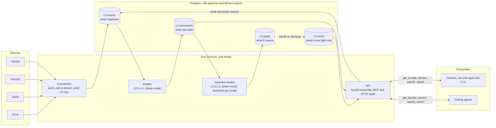

# hearsay

Hearsay is an open-source context platform for teams using coding agents. The
decisions about a piece of work are scattered across chat threads, meetings,
issue comments and PR reviews, so handing that context to an agent means either
pointing it at one source or hand-writing a long prompt. Hearsay ingests team
communication and artifacts, distills them into layered knowledge that keeps its
provenance, and serves scoped, permission-filtered context bundles to agents and
humans through a small read and assert API. It is the thing an agent asks
instead: chat apps, CLIs and trackers become interfaces to it rather than the
place context lives.

Status: early. The design is written and the scaffold is in place; the layers
are being built.

- [docs/design.md](docs/design.md) — what Hearsay is and how it works.
- [docs/adr/](docs/adr/) — the implementation decisions and why they were made.
- [docs/connector-contract.md](docs/connector-contract.md) — the L0 event a
  source connector emits, and the interface it implements.
- [CONTRIBUTING.md](CONTRIBUTING.md) — how to build, test and run it.

## Architecture

A rough view of the design: sources feed four services that write and read four
layers in one Postgres. Model calls happen only on the write path; every read is
a structured lookup. [docs/design.md](docs/design.md) has the full picture.



GitHub and Discord connectors ship today, along with Drive folder and Obsidian vault backfill.
Drive change sync, Obsidian live sync and Slack are where the design points next.

## Quick start

```sh
dagger check           # lint, tests and the image: every gate, in parallel
dagger up              # Postgres plus all four services
dagger api call hearsay qa --script 'hearsay version'   # try a change in the shipped image
```

The export is not optional: Homebrew and winget carry an older CLI, which reads
this workspace and does nothing useful with it. Any CLI runs the pinned release
on demand, and caches it the first time.

Or without [Dagger](https://dagger.io), which needs a container runtime:

```sh
go build ./...
go test ./...
go run ./cmd/hearsay help
```

The four services — connectors, distiller, assertion worker and API — are
subcommands of one binary. The API serves the context bundle and the handles a
consumer follows it with, over MCP and HTTP. The distiller is real, and so are
the layers around it: `hearsay migrate` builds the schema, `hearsay l0` reads what
has been ingested, `hearsay distiller` turns those events into L1 documents, and
`hearsay assert-worker` turns the documents that decided, proposed or resolved
something into L2 topics and stances.
`hearsay connectors` is real too — it hosts, polls and backfills the connectors
configuration names. GitHub (`type: github`) ingests issues, pull requests,
reviews, comments and commits by webhook and backfill. Discord (`type: discord`)
ingests guild messages, threads and reactions through its Gateway, backfills
channel and thread history over REST, and re-syncs visibility changes. A source of
an unregistered type is a startup failure.

## License

[MIT](LICENSE).
